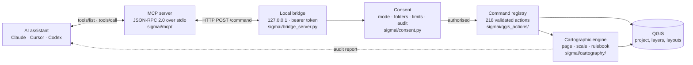

<div align="center">


**Secure GIS-AI Interface** — a local, auditable bridge that lets AI assistants operate QGIS.

[](https://plugins.qgis.org/plugins/sigmai/)
[](https://modelcontextprotocol.io)
[](LICENSE)
[](https://github.com/LuanCortesM/SIGMAI/actions/workflows/tests.yml)

[Português](docs/pt-BR/LEIAME.md) · [Install](#install) · [Connect an AI client](#connect-an-ai-client) · [Cartographic rulebook](#the-cartographic-rulebook) · [Security](#security-model)

</div>

---

## What this is

Ask an AI assistant to make you a map today and it will either write PyQGIS for you to paste, or drive your screen with a mouse robot. The first makes you the runtime; the second is unauditable and breaks on the next UI change.

SIGMAI takes a third path. It runs inside QGIS as a plugin and exposes a **local, token-protected command interface** with a fixed vocabulary of validated JSON commands. An AI assistant connects to it through the **Model Context Protocol**, asks what the project contains, and issues commands that the plugin validates, authorises against rules you set, executes, logs, and then **audits**.

That last step is the part that matters. Producing a map is easy; producing a map that is *cartographically correct* is not, and an assistant that receives no useful feedback cannot tell the difference. SIGMAI ships an explicit rulebook — legend covers every visible layer, scale bar spans a legible fraction of the frame, coordinate grid actually renders, datum declared, north arrow is a symbol and not the letter N — and returns a report saying which rules failed, why the rule exists, and which command fixes it.

## Install

**From the QGIS Plugin Repository** — `Plugins ▸ Manage and Install Plugins ▸ All`, search for *SIGMAI*.

**From a ZIP** — download `dist/sigmai.zip` from a release, then `Plugins ▸ Manage and Install Plugins ▸ Install from ZIP`.

Then open the SIGMAI panel from the toolbar. No external Python packages are required: SIGMAI runs on the interpreter that ships with QGIS/OSGeo4W.

The panel speaks nine languages — Português (Brasil), English, Español, Français, Deutsch, Italiano, 日本語, 简体中文, 繁體中文 — chosen from the list in its header, each named in itself. It follows the QGIS theme (light or dark, including *Night Mapping*) with a palette of its own for each, and *Advanced ▸ Appearance* forces one if you prefer. The maps the assistant composes carry their own frame texts in fifteen languages (`map_language`), independent of the panel language.

## Connect an AI client

The panel does this for you — pick your program in step 2 and it produces the exact configuration block with the correct absolute paths. For reference, the shape is the same everywhere:

```json
{
  "mcpServers": {
    "sigmai": {
      "command": "C:\\OSGeo4W\\apps\\Python312\\python.exe",
      "args": ["C:\\Users\\you\\AppData\\Roaming\\QGIS\\QGIS3\\profiles\\default\\python\\plugins\\sigmai\\mcp\\sigmai_mcp.py"],
      "env": { "PYTHONUNBUFFERED": "1", "PYTHONUTF8": "1" }
    }
  }
}
```

| Client | Where the configuration lives | Guide |
|---|---|---|
| Claude Desktop | `%APPDATA%\Claude\claude_desktop_config.json` | [docs/CONNECT_WITH_CLAUDE.md](docs/CONNECT_WITH_CLAUDE.md) |
| Claude Code | `.mcp.json` in the project, or `~/.claude.json` | [docs/CONNECT_WITH_CLAUDE.md](docs/CONNECT_WITH_CLAUDE.md) |
| Cursor | `~/.cursor/mcp.json` | [docs/CONNECT_WITH_CURSOR.md](docs/CONNECT_WITH_CURSOR.md) |
| Codex CLI | `~/.codex/config.toml` | [docs/CONNECT_WITH_CODEX.md](docs/CONNECT_WITH_CODEX.md) |
| Anything else | any MCP stdio client works | [docs/MCP_SERVER.md](docs/MCP_SERVER.md) |

Step 3 of the panel runs a self-test across the whole path — bridge, authentication, session file, MCP server, project, access mode — and names the step that failed instead of leaving you to guess.

## What the assistant can do

Eleven MCP tools, deliberately few, each with a validated input schema:

| Tool | Reads | Writes | Purpose |
|---|:--:|:--:|---|
| `sigmai_status` | ✓ | | Bridge state, QGIS version, current access mode and session limits |
| `sigmai_project_overview` | ✓ | | Project, CRS, every layer with id, geometry, extent, fields, draw order |
| `sigmai_layer_details` | ✓ | | Fields, symbology, geometry validity, feature sample |
| `sigmai_cartographic_rulebook` | ✓ | | The rules a map must satisfy, with rationale and fixes |
| `sigmai_plan_map` | ✓ | | Simulate a composition: page, slots, extent, scale — changes nothing |
| `sigmai_compose_map` | | ✓ | Compose, export and audit a complete map |
| `sigmai_audit_layout` | ✓ | | Audit any layout in the project, including hand-made ones |
| `sigmai_list_layouts` | ✓ | | Print layouts in the project |
| `sigmai_capabilities` | ✓ | | Command catalogue, filterable, with the parameters each command reads |
| `sigmai_run_command` | ✓ | ✓ | Any catalogued command: vector, raster, Processing, symbology, workflows |

Behind them sit 221 catalogued commands, 208 of them enabled. `sigmai_run_command` reaches all of the enabled ones; the dedicated tools exist because a typed schema produces fewer wrong calls than a free-form escape hatch. The 13 disabled commands (the atlas family, the PostGIS family and `create_map_hierarchy`) are refused by the bridge as if they did not exist and listed in `get_capabilities` with the reason — the catalogue describes what the plugin does, not what it might do one day.

## Access control

Read commands and dry runs always work. Everything that changes the project or writes a file goes through a consent layer you control from the **Access** tab:

- **Read only** (default) — the assistant inspects and simulates. A refused write returns a message telling it to show the plan and ask you to unlock, so it stops instead of retrying.
- **Ask every time** — each changing action opens a dialog naming the action, the category and the files it would write.
- **Allow for this session** — no prompts, inside the folders and limits you set.

Independently of the mode: **output folders** restrict where files may be written; **per-session limits** cap project changes, exports and Processing runs; the **Activity** tab records every decision. Installing, removing or reloading plugins and executing Python are never covered by consent — they require Developer Mode, enabled by hand.

## The cartographic engine

`compose_map` is not a template filler. For a given page and set of layers it:

- resolves the page (A5–A0, portrait or landscape, or custom millimetres) and solves a layout whose slots are guaranteed to sit inside the margins — a wide page gets a side column, a tall page a bottom band;
- expands the extent to the map frame's aspect ratio **before** applying the margin, so the margin you asked for is the margin you get on both axes;
- closes the scale on the cartographic series (1:250 000, not 1:257 090), and says so, including the margin that resulted;
- sizes the scale bar to span 15–45% of the frame, ending on a round number in a sensible unit;
- computes a coordinate grid interval from the extent and places the annotations outside the frame, vertical on the sides;
- builds the legend from **every layer in the map frame**, not just the primary one;
- places a real north arrow symbol linked to grid north;
- declares datum, projection, source, authorship and date;
- reprojects to the appropriate UTM zone when the project is in geographic coordinates, because a metric scale bar over degrees is wrong across most of the sheet.

Then it audits what it produced and returns the report.

## The cartographic rulebook

29 rules across nine categories — elements, scale, orientation, provenance, grid, geometry, typography, projection, data. Each carries its severity, the reason it exists, its reference, and the command that satisfies it. `sigmai_cartographic_rulebook` returns the whole thing as data, so an assistant can read the rules before composing rather than discovering them by failing.

A worked example of why this matters is in [docs/CARTOGRAPHIC_QUALITY_MODEL.md](docs/CARTOGRAPHIC_QUALITY_MODEL.md): the same map that the 0.1.1 evaluator graded *"A — Professional map"* with zero warnings scores **E — invalid** under the rulebook, with three blocking errors that a reader would have spotted immediately.

## Architecture



The split between `cartography` and the rest is deliberate: `pagespec`, `scaling`, `layoutgrid` and `rulebook` never import PyQGIS, so the cartographic decisions can be tested in CI where no QGIS exists. Only `compose` and `inspector` touch the QGIS layout API.

## Development

```bash
git clone https://github.com/LuanCortesM/SIGMAI.git
cd SIGMAI
python -m pytest tests -q          # 540 tests; the 33 that need PyQGIS skip themselves without QGIS
python tools/package_qgis_plugin_zip.py
```

Tests that need a live QGIS live in `tools/` and run against a real instance: `exercise_commands.py`, `exercise_plugins_and_basemaps.py`, `exercise_third_party_plugin.py`, `scenario_runner.py` (243 multilingual scenarios in `tests/cenarios/`) and `release_battery.py`, the gate a version has to pass before it ships — 672 checks across every template, page, orientation, format, data type and map language. Everything in `tests/` runs on plain Python.

See [CONTRIBUTING.md](CONTRIBUTING.md) for how to propose changes, report a problem or ask for help, and [docs/ARCHITECTURE.md](docs/ARCHITECTURE.md) for the internals.

## Security model

- The bridge binds to **127.0.0.1 only** and rejects any non-local client.
- Every command requires a **bearer token**; a request without one is refused with 401. `/health` is the single unauthenticated endpoint and returns nothing beyond existence and version.
- The command surface is an **allowlist** of typed handlers. There is no generic evaluator; normal operation cannot execute arbitrary Python.
- **Developer Mode** is off by default, must be enabled in the QGIS interface with a typed confirmation, and is the only route to Python execution.
- Existing files are never overwritten without `confirm_overwrite`.
- Logs and audit records never contain tokens, passwords or credentials.

Full model: [docs/SECURITY_MODEL.md](docs/SECURITY_MODEL.md) · [docs/MCP_SECURITY_MODEL.md](docs/SECURITY_MODEL.md).

## Authorship

Plugin author: **MACIEL, L. S. C.** — herpetomantiqueira@gmail.com
Developed by Luan da Silva Cortes Maciel as a research product associated with Herpeto Mantiqueira.

**The plugin author is not the author of the maps you make with it.** Generated maps credit the map author you supply, your SIGMAI user profile, or a neutral `Produzido com SIGMAI/QGIS` line. See [docs/MAP_AUTHORSHIP_POLICY.md](docs/MAP_AUTHORSHIP_POLICY.md).

## Citation

```bibtex
@software{maciel_sigmai,
  author  = {Maciel, Luan da Silva Cortes},
  title   = {{SIGMAI}: Secure {GIS}-{AI} Interface},
  version = {1.0.2},
  url     = {https://github.com/LuanCortesM/SIGMAI},
  license = {GPL-3.0-or-later}
}
```

Machine-readable metadata: [CITATION.cff](CITATION.cff).

## License

GNU General Public License v3.0 or later. See [LICENSE](LICENSE).
